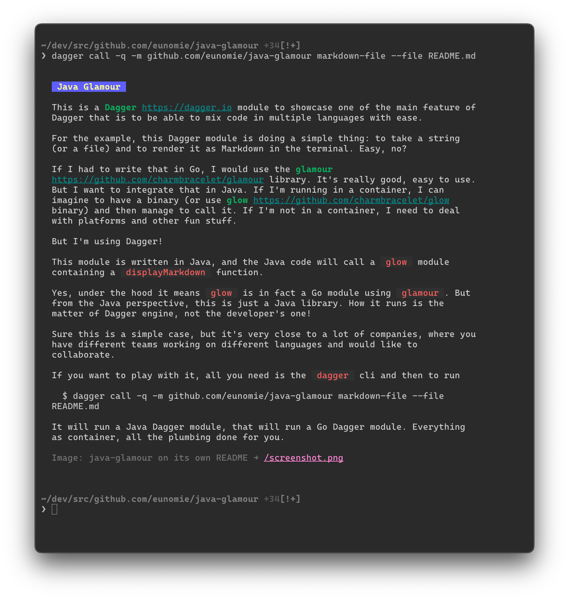

# Java Glamour

This is a [Dagger](https://dagger.io) module to showcase one of the main feature of Dagger that is to be able to
mix code in multiple languages with ease.

For the example, this Dagger module is doing a simple thing: to take a string (or a file) and to render it
as Markdown in the terminal. Easy, no?

If I had to write that in Go, I would use the [glamour](https://github.com/charmbracelet/glamour) library. It's really
good, easy to use. But I want to integrate that in Java. If I'm running in a container, I can imagine to have a binary
(or use [glow](https://github.com/charmbracelet/glow) binary) and then manage to call it. If I'm not in a container,
I need to deal with platforms and other fun stuff.

But I'm using Dagger!

This module is written in Java, and the Java code will call a `glow` module containing a `displayMarkdown` function.

Yes, under the hood it means `glow` is in fact a Go module using `glamour`. But from the Java perspective, this is just
a Java library. How it runs is the matter of Dagger engine, not the developer's one!

Sure this is a simple case, but it's very close to a lot of companies, where you have different teams working on
different
languages and would like to collaborate.

If you want to play with it, all you need is the `dagger` cli and then to run

```console
$ dagger call -q -m github.com/eunomie/java-glamour markdown-file --file README.md
```

It will run a Java Dagger module, that will run a Go Dagger module. Everything as container, all the plumbing done for
you.


